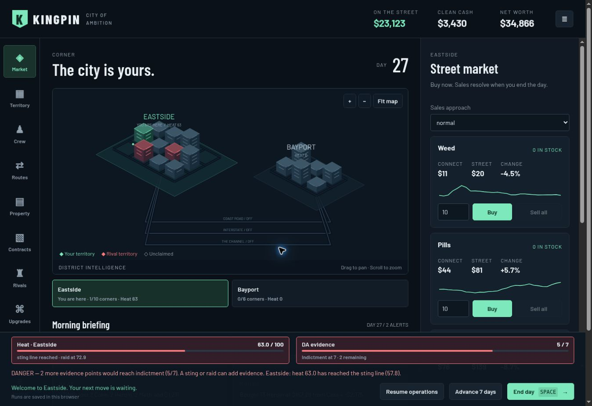

# The web client

The graphical client (`cmd/kingpin-web`, #328, #339) runs the real Go engine in the browser through WebAssembly. Phaser 3.90.0 renders the interactive isometric territory map. Semantic HTML provides the management panels, forms, and dialogs. No backend process or gameplay reimplementation is involved.

```sh
go run ./cmd/kingpin-web              # http://127.0.0.1:8080/
go run ./cmd/kingpin-web -out site/   # static site, including engine and Phaser
go test ./cmd/kingpin-web             # WASM reference games and cue coverage
```

The Go toolchain must match `go.mod`. `Build` embeds `web/`, compiles `cmd/kingpin-wasm`, and copies that toolchain's `wasm_exec.js`. There is no npm build step. The pinned Phaser distribution and MIT notice are in `web/vendor/`; the game does not fetch Phaser from a CDN at runtime. Google Fonts supplies optional Barlow fonts, with system fallbacks.



## The contract

`js/session.js` is unchanged: `Session` wraps `kingpin.open()`, sends JSON-RPC commands through `handle`, and reads view/event notifications. It supports protocol 3 and view 2 and refuses other versions before play. Every action goes through this session. Prices, purchase costs and eligibility errors come from the engine. Panels draw only the versioned view and public queries such as `house_offers` and `rules.territory.deed_price`; no hidden world state is read.

## The map

`js/phaser-map.js` owns one Phaser game and its scene, camera, input, and tweens. Districts use the cities and corner grid coordinates in the view. Building height is a stable visual variation, not a game statistic. Colour means ownership; a gold outline means a deed; a small mint dot means a runner is posted there. Route lines show their name and pace, and shipments occupy their progress along the route.

- Click a corner to open its territory controls. A native corner selector provides a keyboard alternative.
- Select districts below the map to inspect them. Inspection does not move the player; Market exposes an explicit travel command when elsewhere.
- Drag to pan, scroll or use +/− to zoom, and Fit map to reset.
- `CUE_STYLES` covers all 17 engine cues. Events produce coloured rings and rising labels; shipment cues also move a marker along the route. These effects never mutate or advance the game.
- Effects respect `prefers-reduced-motion`. New/imported runs clear pending effects.

The previous Canvas renderer (`layout.js`, `scene.js`, `sprites.js`, `cues.js`) remains as a reference renderer and acceptance fixture. It is not the active page renderer.

## Playing

The page opens directly into a run, restores `kingpin.save` if available, or creates a random seed. `?seed=7` starts that seed instead of restoring. The header shows dirty cash, clean cash, and net worth; the day and tier are above the map. The morning briefing summarizes up to four report sections. The full last-night report is in Journal.

Ten panels provide:

| Panel | Controls and information |
| --- | --- |
| Market | Street connect prices, street prices, percentage change and history, quantities, buying, queued sales with quiet/normal/aggressive dials, travel |
| Territory | Corner selection, ownership and demand, posting yourself or crew, deed quotes/purchases, abandoning a corner with confirmation, warn/push/hit against rival corners |
| Crew | Recruitment fees, wages, skill and loyalty, payroll policy, posting crew, bail quotes, dismissal confirmation |
| Routes | Route pace, product targets, driver assignment, known risk and in-transit shipments |
| Property | Owned houses and fronts, front investment quotes, house/front/asset purchases, laundering pace |
| Contracts | Offers and deadlines, accepting/declining, delivery quantities |
| Rivals | Known leaders, territory, trust, war, next move, scouting quotes, declaring war with confirmation, accepting/declining offers |
| Upgrades | Full tree, descriptions, prerequisite names, costs and cash pool, availability and purchases |
| Law | DA and chief intelligence, evidence, heat, election date, lie-low toggle and alerts |
| Journal | All sections of the latest morning report |

End day (or Space outside controls/dialogs) advances one day. Advance 7 days uses the engine's fast-forward and reports the reason it stopped. A waiting card blocks day controls and opens a modal with the engine's choices. The ending can be reviewed or followed by a new run. Refused actions show the engine's error, without inventing front-end rules.

Settings include the original autopilot, explicitly labelled as trading for the player. It uses `autoplay.js`, pauses for a card or ending, and stops while settings are open. Manual play remains the default.

## Heat and indictment warnings

Heat and evidence are always visible in the sticky turn-control area on desktop and mobile. The heat meter names the hottest district and the next/current police response line. The evidence meter shows the DA’s file against `rules.heat.evidence_arrest`, including points remaining. Clicking either opens Law, which also shows the local response ladder and the previous night’s heat/law report.

`js/risk.js` reads `rules.heat.ladder` for every visible city and the current indictment limit. It never hardcodes the DA’s six-point base: officials and legal upgrades can change the quoted limit. Amber flags existing evidence or patrol-level attention; red flags any district at a sting-or-higher line or a nonempty file within one response’s base evidence of indictment. This is an attention policy, not a prediction that another night is safe. Evidence can grow through informants, bribes, audits and other actions as well as enforcement.

Critical risk requires a pre-turn decision: review the case, lie low without advancing, or explicitly advance **one** day. Keyboard advancement uses the same guard. Seven-day play retains the engine’s normal stops and checks risk after every day. Autopilot refuses to start in danger and pauses when danger is reached. The ending explains that evidence and heat are separate. Lying low cancels today’s sales/deliveries and helps heat decay; it is not an instant evidence reset or guaranteed escape.

`TestWebClient` checks that the real seeded WASM run warns before indictment, low local heat cannot hide evidence or another district’s heat, changed DA limits are respected, and fast-forward stops at critical evidence.

## Saves and layout

Every successful action exports the engine's save to `localStorage` under the original `kingpin.save` key. Settings provide save/load and export/import of the base64 save as a text `.save` file. The bytes inside remain the engine's save, compatible with the TUI's schema. Starting over requires confirmation; export first to keep the old run. Storage failures display a warning and retain the live session for export.

The desktop layout has navigation, map/briefing, and a scrolling management panel. At narrow widths navigation scrolls horizontally and panels stack beneath the map. Dialogs use native focus management. Selection, quantities, price changes, and ownership are also expressed as text rather than colour alone.

## Validation and scope

`TestWebClient` builds the complete static site and runs its actual session module under Node against WASM. The reference autoplay and multiple seeded/boss runs check protocol compatibility, endings, reference-renderer output, and all engine cue kinds. The Phaser cue-style table is additionally checked against `engine.CueKinds` so a new engine cue cannot silently be omitted.

Browser smoke checks for #339 exercise boot, buying, queued sales, day advancement, hiring, each panel, and saved-run restoration. The engine and protocol tests continue to pin game behavior. The presentation adds no balance or simulation change.

This is broader than the first reference web client, but not complete TUI parity: advanced negotiations, standing orders, production/cutting, detailed house stock transfers, political contributions and special endings do not yet have dedicated controls. All remain engine capabilities for later panels.
